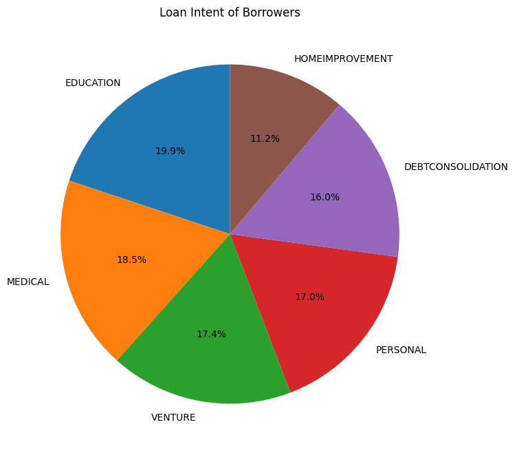
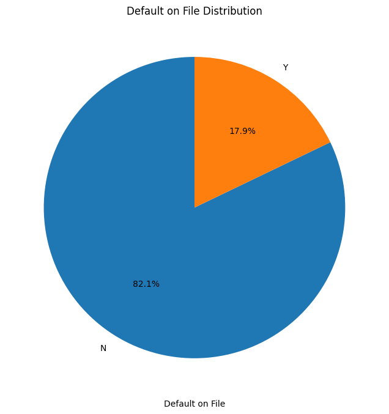
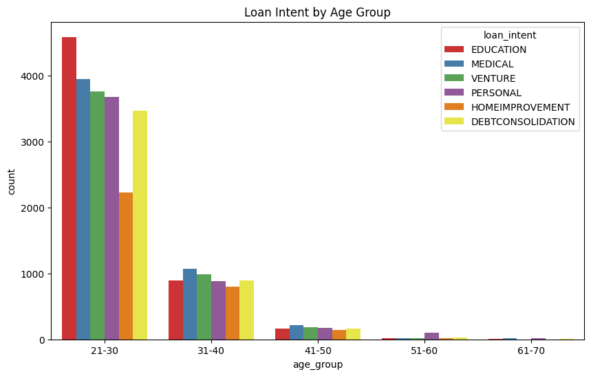
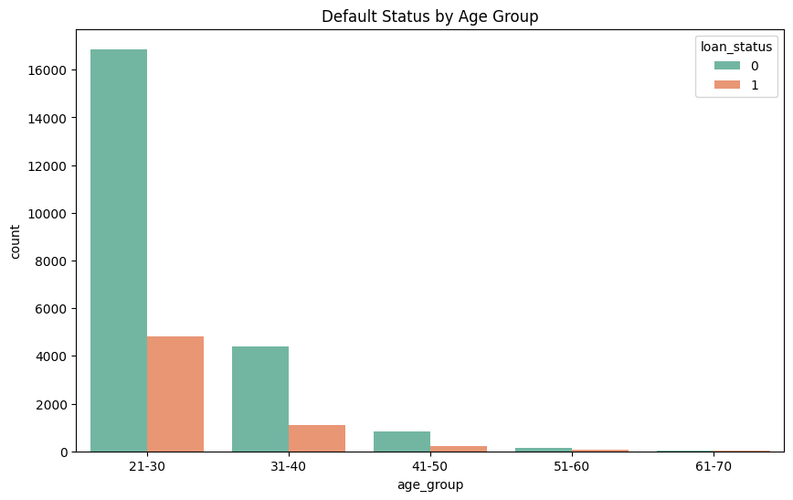

# Credit Risk Assessment and Loan Amount Prediction


## Project Summary
This project addresses critical challenges in financial lending by analyzing a loan dataset to predict credit risk and loan amounts. The dataset, sourced from [Kaggle](https://www.kaggle.com/datasets/laotse/credit-risk-dataset?resource=download), contains 32,581 observations across 12 variables, including borrower demographics, financial indicators, and loan characteristics.

Data preparation included handling missing values, removing duplicates, and addressing outliers in income and employment length. We used pandas for data manipulation and scikit-learn for preprocessing, applying StandardScaler for feature scaling and LabelEncoder for categorical variables.

For credit risk prediction, we tested multiple models such as Logistic Regression, Decision Trees, Random Forest, K-Nearest Neighbors, Gradient Boosting, and XGBoost. XGBoost proved most effective, achieving 93.8% accuracy and an F1 score of 0.842. Loan amount prediction employed Linear Regression, XGBoost, and Artificial Neural Networks, with XGBoost again leading with an R² of 0.99 and an RMSE of 498.28.

Model performance was assessed using an 80-20 train-test split, with metrics such as accuracy, precision, and F1 score for classification, and RMSE, MSE, and R² for regression. SHAP and LIME were applied to enhance interpretability, identifying income, loan-to-income ratio, and loan intent as key predictors.

The project was deployed using Streamlit, offering an interactive interface for real-time credit risk and loan amount predictions. This deployment enhances accessibility, providing valuable tools for lenders to make informed decisions.

## Business Understanding

### Stakeholders
- Financial Institutions (e.g., Banks, Credit Unions): Responsible for managing lending and risk.
- Loan Applicants: Borrowers seeking loans for various purposes.
- Credit Bureaus: Agencies managing credit reports.
- Investors & Shareholders: Those with stakes in financial institutions.
- Regulatory Bodies: Ensuring compliance in lending practices.
- Loan Officers: Individuals assessing loan eligibility.

### Key Questions:
1. Which borrower profiles are most likely to default on their loans?
2. What factors most strongly influence loan approvals?
3. How can institutions optimize loan offerings for various demographics?
4. How effective are machine learning models in predicting loan amounts and credit risk?

## Exploratory Data Analysis (EDA)

1. **Loan Intent**:
   - Educational loans make up 19.86% of the total loans, followed by medical and personal reasons.
   - Home improvement loans constitute only 11.08%.

   

2. **Default on File Distribution**:
   - 82% of borrowers have defaulted before, while 18% have clean records.

   

3. **Loan Intent by Age Group**:
   - Borrowers aged 21-30 mainly take loans for education, while older borrowers (51-60) focus on personal and medical reasons.

   

4. **Default Status by Age Group**:
   - Younger borrowers (21-30) tend to default more often.

   
   

## Modeling

### Credit Risk Classification (Binary Classification)

Six machine learning models were evaluated:
1. Logistic Regression
2. Decision Tree
3. Random Forest
4. K-Nearest Neighbors (KNN)
5. Gradient Boosting
6. XGBoost (final model)

#### Model Performance:
| Model              | Accuracy | Precision | Recall  | F1 Score |
|--------------------|----------|-----------|---------|----------|
| Logistic Regression| 0.850    | 0.750     | 0.474   | 0.581    |
| Decision Tree      | 0.882    | 0.714     | 0.766   | 0.739    |
| Random Forest      | 0.934    | 0.964     | 0.725   | 0.828    |
| KNN                | 0.886    | 0.813     | 0.625   | 0.706    |
| Gradient Boosting  | 0.926    | 0.944     | 0.705   | 0.808    |
| **XGBClassifier**  | **0.938**| **0.957** | **0.752**| **0.842**|

### Loan Amount Prediction (Regression)

Three models were used to predict loan amounts:
1. Linear Regression (baseline)
2. XGBoost (best performer)
3. Artificial Neural Networks (ANN)

#### Regression Performance:
| Model              | RMSE    | MSE        | MAE     | R²        |
|--------------------|---------|------------|---------|-----------|
| Linear Regression  | 3684.03 | 1.357e+07  | 2417.26 | 0.654     |
| ANN                | 630.32  | 3.973e+05  | 388.39  | 0.990     |
| **XGBRegressor**   | **498.29**| **227.17** | **751.80**| **0.994**|

## Model Interpretation

### XGBClassifier Interpretation:

- **LIME** was used for local interpretability, showing how different features impacted the probability of loan default.
- **Top Features**: `loan_intent`, `loan_grade`, `person_income`, `person_emp_length`.


### XGBRegressor Interpretation:


- **SHAP** summary plot showed that `loan_percent_income` and `person_income` were the most impactful features.
- Higher values for these features increased the loan amount prediction, while lower values decreased the predicted amount.

## Deployment
# Credit-Risk-Assessment-with-Loan-Amount-Prediction


outputs


## Key Results

- **XGBClassifier** achieved high precision (95.7%) in identifying non-default loans.
- **XGBRegressor** produced highly accurate loan amount predictions with R² of 0.994, RMSE of 498.29.
- **Top features** influencing predictions were borrower income, credit history length, and loan grade.

## Conclusion
In today's rapidly evolving financial sector, the need for precise and reliable credit risk assessment and loan amount prediction models is paramount for informed and data-driven lending decisions. This project demonstrates how machine learning, particularly the use of XGBoost models, significantly enhances the accuracy and efficiency of these processes, helping financial institutions manage risk more effectively while providing better loan offerings tailored to borrowers' needs.

## Findings
1. **Borrower Profiles and Loan Intentions**: Significant insights into financial behaviors and needs revealed that many loans were taken for educational purposes and home improvement. Financial institutions could design products that cater to these segments.
  
2. **Default History and Risk Mitigation**: The dataset shows a significant proportion of borrowers with a default history, highlighting the need for better risk assessment strategies and financial literacy programs.

3. **Demographic Insights and Borrowing Patterns**: Analysis indicated that younger individuals (21-30 age group) primarily apply for educational loans, while older borrowers request personal loans. This calls for tailored loan offerings based on borrower demographics.

4. **Model Performance and Comparative Analysis**: The XGBoost models outperformed others in both credit risk classification and loan amount prediction, achieving high accuracy and R² values.

5. **Feature Importance**: Analysis showed that features such as income, loan grade, and loan percent income significantly influenced loan outcomes, providing actionable insights for financial institutions.

## Recommendations for Financial Institutions
- **Custom Loan Products**: Develop targeted loan offerings for specific borrower segments.
- **Enhance Risk Assessment**: Integrate machine learning models into the loan approval process.
- **Financial Literacy Programs**: Implement educational initiatives for borrowers.
- **Continuous Model Monitoring**: Regularly update models as new data becomes available.
- **Advanced Techniques**: Explore ensemble learning methods for comprehensive credit risk prediction.

## Getting Started

### Prerequisites
- Python 3.7+
- Libraries: pandas, scikit-learn, xgboost, shap, lime, streamlit

### Installation

1. Clone the repository:
   ```
   git clone https://github.com/Divinegrace05/Credit-Risk-Assessment-and-Loan-Amount-Prediction
   ```

2. Install dependencies:
   ```
   pip install -r requirements.txt
   ```

### Running the Streamlit App

To run the Streamlit app locally:

```
streamlit run app.py
```

Navigate to the provided local URL in your browser to interact with the loan prediction models.

## Thank You
